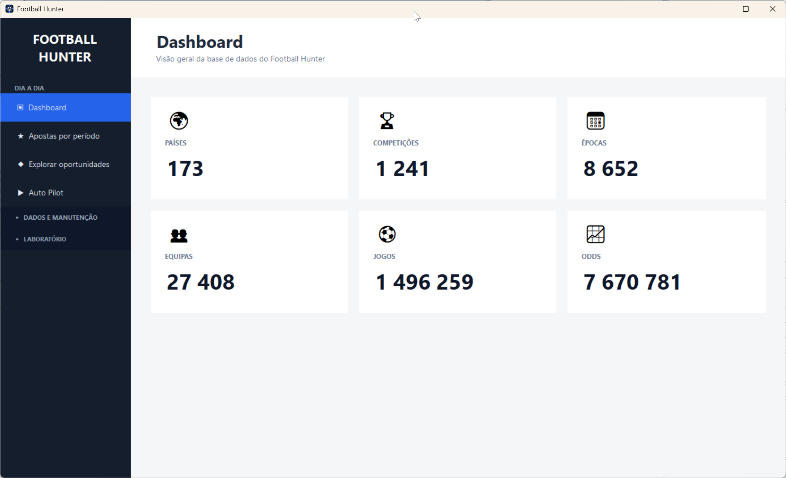
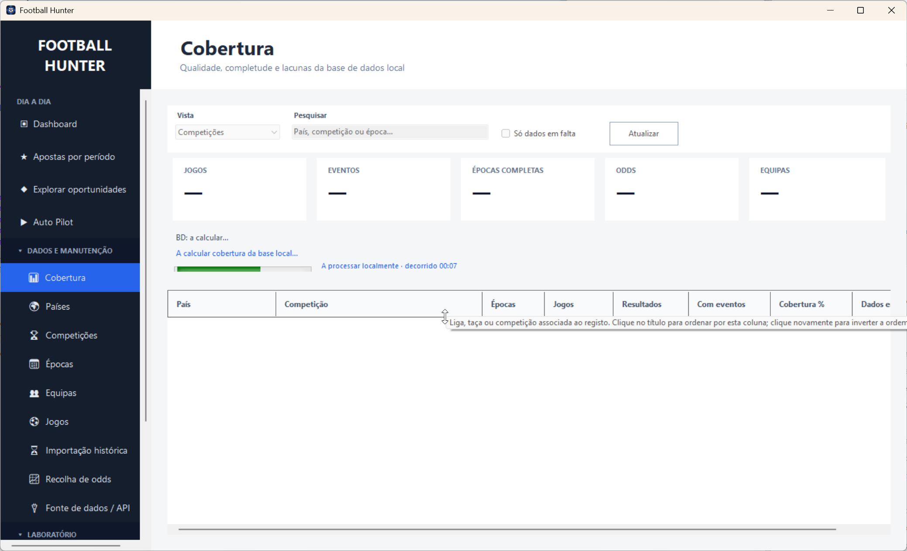
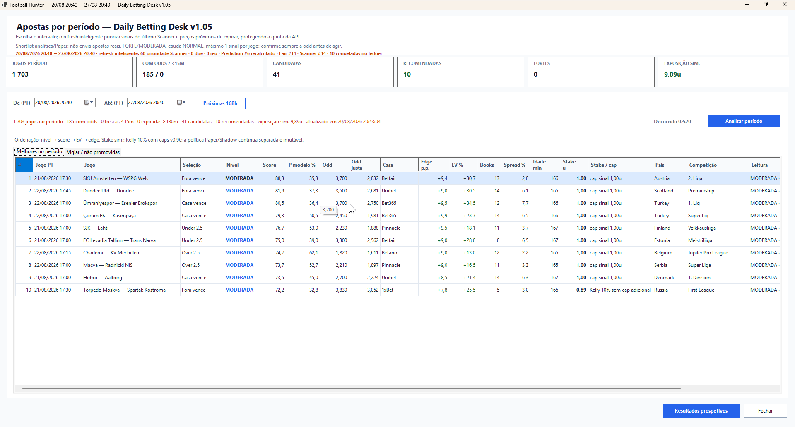
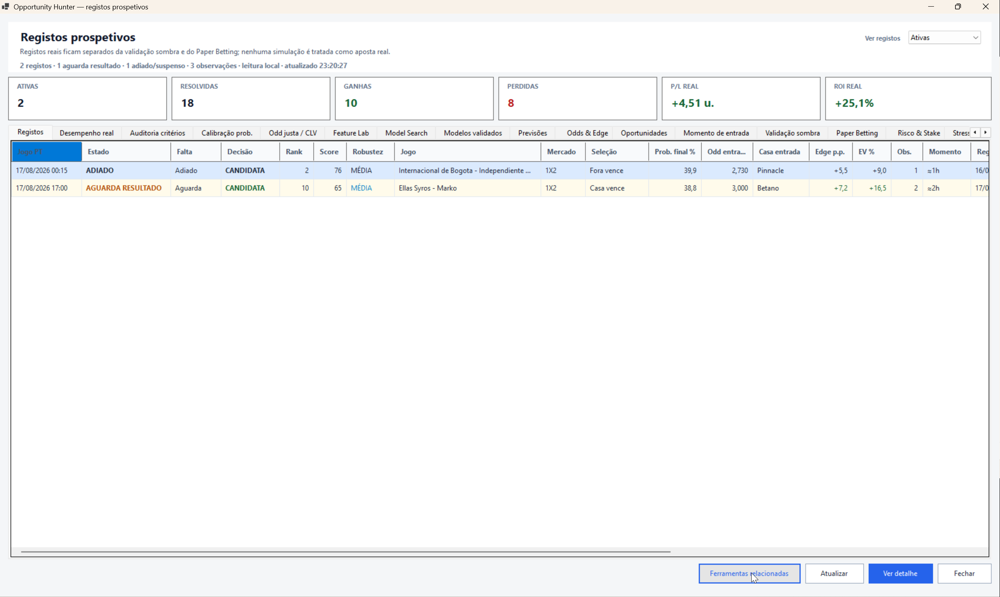

# Football Hunter

> Football data collection, historical analysis, odds research, model discovery and prospective decision support in a dedicated .NET desktop application.

## About the project

**Football Hunter** is a desktop research application I am building to collect, organise and analyse football data at scale.

The project combines historical match data, pre-match information and betting-market data with tools for statistical analysis, model discovery, prospective validation and decision support. Its purpose is not simply to display scores or odds: the application is being designed as a controlled research environment for testing whether repeatable, explainable patterns exist in football markets.

This repository is the **public showcase** for the project. The application source code, local data store, API credentials and proprietary datasets remain private.

## Current milestone — v1.08

Version **1.08** adds a single-screen **Daily Tips** workflow.

The main product question for this milestone was simple:

**Can the application be opened and used day to day without navigating through a long chain of technical research screens?**

The answer in v1.08 is now yes.

The main daily entry point presents three compact views:

- **Today** — the current promoted tips from the latest full-day prospective snapshot;
- **History** — the real prospective recommendation history and settlement state;
- **Watch / not promoted** — the current session's signals that were analysed but did not become tips.

The underlying scientific pipeline is still the same. The new screen is a presentation and orchestration layer, not a shortcut around model, price or risk controls.

### One operational screen

The Daily Tips screen shows at a glance:

- number of current tips;
- strong and moderate signals;
- number of resolved historical recommendations;
- descriptive hit rate;
- theoretical ROI and P/L;
- match time;
- match and selection;
- confidence tier and score;
- model probability;
- execution odds and model fair odds;
- edge and expected value;
- simulated stake;
- bookmaker, country and competition;
- when the recommendation snapshot was frozen.

Opening the screen reads the local prospective ledger only and does **not** automatically consume API quota.

When the user chooses **Update tips**, Football Hunter runs the existing daily pipeline for the remainder of the day:

`Champion predictions -> smart odds refresh -> fair-price audit -> Opportunity Scanner -> simulated risk/stake -> prospective ledger`

The resulting recommendations are then shown in the same screen.

### Prospective history

The History view does not manufacture retrospective tips.

It starts from the point at which the prospective ledger was actually activated and uses the **first recommendation for each match/target pair** as the primary history cohort, so repeated analyses do not artificially inflate counts or performance statistics.

The view exposes:

- open and resolved recommendations;
- final match result where available;
- hit/miss outcome;
- theoretical P/L;
- model probability and fair odds at capture time;
- execution odds, edge, expected value and simulated stake.

A simple filter switches between **All**, **Resolved** and **Open** recommendations.

Hit rate is deliberately presented as a descriptive metric rather than automatically coloured as "good" or "bad"; the economic result is tracked separately through ROI/P&L.

### Explainability remains one click away

Version 1.08 integrates the **Decision Trace** introduced in v1.07 directly into the daily workflow.

A current or historical tip can be opened to inspect the exact analytical path behind it:

`Champion -> probability -> price/audit -> Opportunity Scanner -> Daily Tips`

The advanced configurable Daily Betting Desk is also still available through **Custom period**, so simplifying the normal workflow did not remove research functionality.

## v1.07 — Decision Trace / Explainability

Version **1.07** introduced a read-only Decision Trace for current and previously frozen signals.

For a selected recommendation, Football Hunter can expose:

- the Champion Registry ID and immutable model fingerprint;
- raw model probability and the probability actually used by the pipeline;
- stored base rate and probability-coherence method;
- model fair odds and current execution price;
- market probability, edge and expected value;
- bookmaker coverage, market margin, price spread and quote age;
- price quality, domain/applicability and audit decision;
- Opportunity Scanner state, tier, score, tail-risk classification and conflicts;
- the Daily Desk promotion decision and simulated stake/caps;
- the exact Prediction, Fair Odds and Scanner run IDs behind the decision.

When the original model fingerprint and current frozen Champion still match, the trace can also reconstruct individual feature contributions using the stored model profile.

A mathematical sanity check reconstructs raw probability from the stored base-rate intercept plus feature contributions. During v1.07 validation, one tested recommendation reproduced the frozen raw probability with a **0.000 percentage-point difference**.

Older observations remain auditable even when feature-level reconstruction is no longer safe. The system keeps the frozen decision chain and explicitly marks feature explanation as partial instead of inventing retrospective data.

## v1.06 — temporal model monitoring

Version **1.06** introduced a temporal **Drift & Stability Monitor** on top of the prospective Champion-monitoring workflow.

The monitor uses only predictions frozen prospectively before matches and does not recalibrate, replace or disable models automatically.

For each active Champion, Football Hunter compares chronological windows using metrics including:

- Brier score;
- calibration error (ECE);
- Brier gain versus baseline;
- Log Loss;
- mean predicted probability;
- observed outcome frequency;
- model/cohort fingerprint integrity.

At the v1.06 validation point, the four active Champions had **892 resolved prospective observations in total** and cohort integrity remained OK. Diagnostic alerts are review signals, not automatic model-replacement decisions.

## Prospective validation

A major change in the project since the early backtesting stages is the addition of a prospective research workflow.

Football Hunter can freeze model predictions before matches and follow them forward without rewriting the historical decision. This allows the application to compare what a model actually said in advance with what happened later.

The current workflow includes:

- immutable validated-model snapshots;
- prospective prediction capture;
- shadow validation;
- paper-betting simulation;
- risk and stake simulation;
- portfolio stress testing;
- policy comparison;
- prospective evidence tracking;
- calibration monitoring;
- cohort-integrity auditing;
- Champion health monitoring;
- temporal drift and stability monitoring;
- decision trace and model explainability;
- single-screen daily tips and prospective history.

## Model discovery and Champion workflow

The **Opportunity Hunter** workflow automatically explores combinations of pre-match features, windows and weights instead of relying only on manual filter-by-filter testing.

Model discovery is deliberately separated from final evaluation. Candidate models move through controlled stages before a model can be treated as a validated **Champion**.

Examples of pre-match features used or explored include:

- recent home and away performance;
- points-per-game and win/loss form;
- goals scored and conceded;
- overall recent form;
- opponent strength and scheduling context;
- market-specific goal and BTTS statistics;
- attacking and defensive interactions;
- derived home/away strength indicators.

The current validated set covers four targets across **1X2** and **Over/Under 2.5** markets.

## Model evaluation

Football Hunter is built around a strict separation between **model discovery**, **out-of-sample validation**, **sealed final evaluation** and **prospective observation**.

Important evaluation concepts include:

- out-of-sample testing;
- sealed final samples;
- immutable model snapshots;
- estimated probability;
- fair odds;
- edge versus market price;
- expected value;
- calibration metrics such as Brier score and ECE;
- Log Loss;
- ROI and robustness;
- minimum sample-size requirements;
- temporal stability;
- explainability and decision provenance;
- prevention of data leakage.

A high historical hit rate by itself is not considered sufficient evidence that a model is useful.

## Risk and portfolio research

The project also includes a fully simulated portfolio layer so that model quality can be studied separately from money management.

Current research components include:

- Kelly-based stake simulation with conservative caps;
- per-signal, per-market/day and daily exposure limits;
- portfolio stress simulations;
- correlation stress scenarios;
- guardrail-policy comparison;
- prospective A/B policy evaluation.

These layers are deliberately read-only or simulated and do not place real bets.

## What Football Hunter is designed to do

- Collect football competitions, teams, fixtures and historical results.
- Import and organise large volumes of historical match data.
- Work with pre-match odds across markets such as **1X2** and **Over/Under**.
- Analyse home/away form, goals, results and other pre-match features.
- Compare historical patterns across leagues, countries and seasons.
- Search automatically for promising statistical models.
- Evaluate models on genuinely separated samples.
- Freeze prospective predictions and audit their integrity later.
- Compare model probability with fair and available market prices.
- Rank current opportunities while explaining why alternatives were rejected.
- Reconstruct the analytical path behind a current or frozen decision.
- Explain how individual Champion features contributed to a model output when safe to do so.
- Show current tips and their real prospective history in one operational screen.
- Monitor whether validated models remain stable through time.
- Keep historical calculations free from future information.

## Selected development milestones

| Version | Milestone |
| --- | --- |
| v0.94 | Initial Git baseline for the private application repository |
| v0.95 | Paper-betting simulation |
| v0.96 | Risk and stake simulation |
| v0.97 | Portfolio stress analysis |
| v0.98 | Correlation-stress scenarios |
| v0.99 | Portfolio guardrail Policy Lab |
| v1.00 | Prospective Policy A/B pilot |
| v1.01 | Prospective evidence monitoring |
| v1.02 | Prospective calibration workflow |
| v1.03 | Calibration-cohort integrity audit |
| v1.04 | Configurable Daily Betting Desk and ranked period shortlist |
| v1.05 | Smart odds refresh, prospective ledger, Champion health, observable progress and simplified navigation |
| v1.06 | Champion drift and stability monitoring with chronological prospective windows |
| v1.07 | Decision Trace with model, price, Scanner and feature-level explainability |
| **v1.08** | **Single-screen Daily Tips workflow with prospective history and direct Decision Trace access** |

## Application areas

### Data collection

Collection and maintenance of competitions, seasons, fixtures, results and related historical information.

### Odds research

Importing and analysing pre-match market data, comparing market probabilities, available prices, price quality and bookmaker coverage.

### Historical analysis

Exploring performance and event patterns across leagues, countries, seasons and match contexts.

### Backtesting

Testing hypotheses against historical data with an emphasis on chronological correctness and strict sample separation.

### Opportunity discovery

Automatically searching a much larger model space than would be practical through manual dropdown-by-dropdown testing.

### Prospective monitoring

Freezing model outputs before matches and tracking subsequent performance, calibration, integrity and temporal stability.

### Explainability

Tracing a signal through the model, market audit, Scanner and daily-decision layers, with feature contributions and run-level provenance when available.

### Daily Tips

Showing today's currently promoted analytical tips, the real prospective history, settlement state and direct explanation access in one screen.

### Advanced Daily Betting Desk

Running the same validated prediction, smart odds-refresh, opportunity and simulated-risk pipeline over a user-selected time interval when a custom period is needed.

## Technology

| Area | Technology |
| --- | --- |
| Language | VB.NET |
| Runtime | .NET 10 |
| Desktop UI | Windows Forms |
| Data sources | Football APIs and odds data |
| Analysis | Statistical feature engineering, backtesting and prospective validation |
| Architecture | Local desktop research application |
| Versioning | Git/GitHub with validated annotated release tags |

## Engineering challenges

The project deals with practical engineering problems that become important once football data grows beyond a small prototype:

- importing large historical datasets without freezing the user interface;
- handling API quotas and interrupted imports safely;
- keeping long-running operations observable through progress indicators and elapsed-time feedback;
- normalising high-volume odds data to control database growth;
- distinguishing genuine missing data from incomplete provider coverage;
- preventing historical analysis from using information unavailable before a match;
- preserving immutable prospective decisions;
- keeping the desktop interface responsive while analysis runs in the background;
- combining model, price, risk and portfolio layers without silently changing the underlying model output;
- monitoring calibration drift without automatically reacting to short-term noise;
- keeping an explainability layer faithful to frozen decisions instead of retroactively inventing reasons;
- simplifying daily operation without bypassing scientific controls.

## Development approach

Football Hunter is developed iteratively, with frequent small releases and direct validation of each workflow.

The current approach emphasises:

- **data integrity first** — statistical conclusions are only as good as the underlying data;
- **explainability** — useful models and decisions should be inspectable, not just numerically attractive;
- **out-of-sample discipline** — model selection and final evaluation remain separate;
- **prospective evidence** — historical backtests are supplemented by frozen forward observations;
- **temporal monitoring** — validated models are observed through time instead of assumed to remain stationary;
- **operational simplicity** — advanced research should not require a complex daily workflow;
- **responsive UX** — long operations need progress, cancellation where appropriate and clear state feedback;
- **scalability** — data structures and imports must remain workable as the database grows;
- **incremental refinement** — new capabilities are added and validated in controlled steps.

## Project status

🟠 **Active development — latest validated milestone: v1.08**

The application can now collect and analyse real football data, search and validate models, freeze prospective predictions, generate current analytical tips from live market data, preserve their real forward history, monitor Champion stability and explain individual decisions end to end.

The next development stages focus on **prospective Challenger comparison**, a formal **Champion promotion gate**, price/CLV monitoring and stronger portfolio intelligence while prospective evidence continues to accumulate.

## Screenshots

### Daily workflow and reorganised navigation

The main interface separates daily decisions from data maintenance and research tools, keeping advanced screens available without crowding the primary workflow.

### Observable long-running operations

Coverage and other heavy local analyses show the current stage, elapsed time and visible progress while keeping the interface responsive.

### Daily Betting Desk

The advanced Daily Betting Desk ranks analytical candidates over a custom period and retains alternatives with an explicit reason for not promoting them.

### Prospective research laboratory

The laboratory keeps real prospective records, model calibration, fair-price analysis, shadow validation, paper simulation and risk research separate but accessible from one workspace.

## About this repository

This repository intentionally contains **no application source code, API keys, private databases or proprietary datasets**. It exists to document and present Football Hunter publicly while development continues privately.

---

Built by [David Almeida](https://github.com/dmalmeida).
